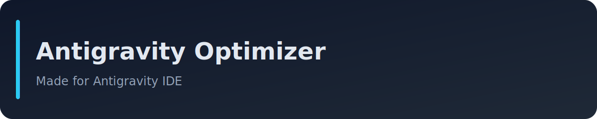

# Antigravity Optimizer



**Stop memorizing skills. Just build.**

[](LICENSE)
[](https://github.com/nzkbuild/antigravity-optimizer)

The **Antigravity Optimizer** automatically picks the right AI skills for your task. 625+ skills, zero memorization.

> **Credits**: Skills are from **[sickn33's Antigravity Awesome Skills](https://github.com/sickn33/antigravity-awesome-skills)**. We just make them easier to use!

---

## 🚀 Quick Start

### 1. Setup
```powershell
.\setup.ps1
```

Choose your mode:
- **[1] Essentials** - Installs skills, removes extra docs
- **[2] Full Repository** - Keeps everything  
- **[3] Update Skills Only** - Quick update (2 seconds)

### 2. Usage

**Windows PowerShell:**
```powershell
.\activate-skills.ps1 "Build a landing page with dark mode"
```

**Linux/macOS:**
```bash
./activate-skills.sh "Build a landing page with dark mode"
```

**Inside Antigravity IDE:**
```
/activate-skills Build a landing page with dark mode
```

---

## 💡 Features

| Feature | Description |
|---------|-------------|
| **625+ Skills** | Auto-updated from sickn33's library |
| **Smart Routing** | Picks the best skills for your task |
| **Cross-Platform** | Windows, Linux, macOS |
| **Auto-Update** | Run setup anytime to get latest skills |
| **Dual Install** | Works in both Codex CLI and Antigravity IDE |
| **Custom Bundles** | Frontend, backend, marketing presets |

---

## 🔧 Bundles

Use preset skill bundles:
```powershell
.\activate-skills.ps1 --bundle frontend "Build a pricing page"
.\activate-skills.ps1 --bundle backend "Create a REST API"
.\activate-skills.ps1 --bundle fullstack "Build a SaaS app"
```

Available: `frontend`, `backend`, `fullstack`, `marketing`, `security`, `product`, `devops`

Edit `bundles.json` to customize.

---

## 📦 Where Skills Go

After setup, skills are installed to:
- `~/.codex/skills/` - For Codex CLI
- `.agent/skills/` - For Antigravity IDE

Both locations are automatically populated.

---

## ❤️ Credits

**Primary Skills Library**: [Antigravity Awesome Skills](https://github.com/sickn33/antigravity-awesome-skills) by **sickn33**. Please star their repo!

## 📄 License

MIT © [nzkbuild](https://github.com/nzkbuild)
